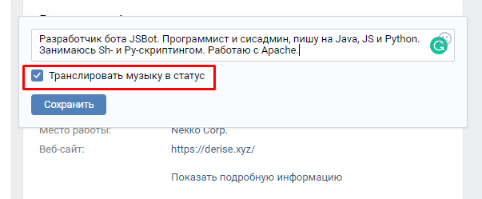
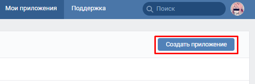
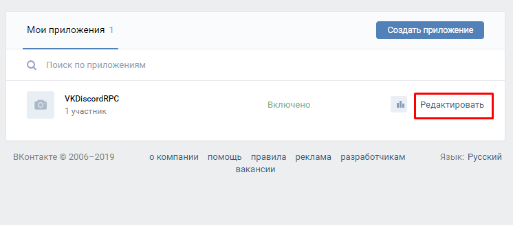
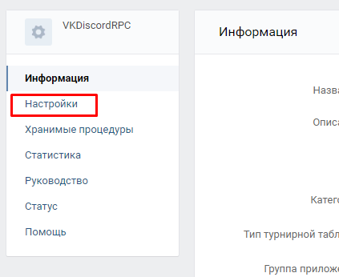
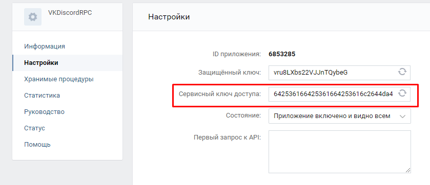
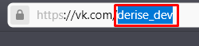

# vk-music-status


Транслирование статуса прослушивания музыки из вк в дискорд (селфбот)

Как скачать? Нажмите на зеленую кнопочку "Code" и потом "Download zip"

#### Инструкция

**_Подготовка:_**

`Все, что здесь написано является ОБЯЗАТЕЛЬНЫМ, и без этого приложение не будет работать`
1. В настройках статуса выставьте галочку "Транслировать музыку в статус"  
  
2. Создайте приложение по [этой ссылке](https://vk.com/apps?act=manage)  
  
3. Скопируйте сервисный ключ доступа и сохраните его где-нибудь, он нам еще понадобится  
  
  
  
4. Скопируйте вашу ссылку на страницу в ВК после vk.com (или же ваш ID) и сохраните её  
  
5. Отредактируйте файл config.ini (замените все на то, что написано). Пример (файл config_example.ini) - 

_id = Ваша короткая ссылка на страницу, которую мы получили в шаге номер 4_  

_app_token = Токен вашего приложения, который мы получили в шаге номер 3_ 

_discord_token = Токен вашего аккаунта в дискорде_  

```bash
python vkmusic.py
```
